  # Multi-Blockchain Wallet in Python

## Background

Your new startup is focusing on building a portfolio management system that supports not only traditional assets
like gold, silver, stocks, etc, but crypto-assets as well! The problem is, there are so many coins out there! It's
a good thing you understand how HD wallets work, since you'll need to build out a system that can create them.

You're in a race to get to the market. There aren't as many tools available in Python for this sort of thing, yet.
Thankfully, you've found a command line tool, `hd-wallet-derive` that supports not only BIP32, BIP39, and BIP44, but
also supports non-standard derivation paths for the most popular wallets out there today! However, you need to integrate
the script into your backend with your dear old friend, Python.

Once you've integrated this "universal" wallet, you can begin to manage billions of addresses across 300+ coins, giving
you a serious edge against the competition.

For the convenience of this project, we set 2 coins to be working: Ethereum and Bitcoin Testnet.

### **Dependencies List:**

- PHP must be installed on your operating system.

- Clone the [`hd-wallet-derive`](https://github.com/dan-da/hd-wallet-derive) tool.

- [`bit`](https://ofek.github.io/bit/) Python Bitcoin library.

- [`web3.py`](https://github.com/ethereum/web3.py) Python Ethereum library.

- Geth & Tools (https://geth.ethereum.org/downloads/)

- MyCrypto (https://download.mycrypto.com/)

- Ganache ver.2.5.4 (https://www.trufflesuite.com/ganache)

### **hd-wallet-derive** 

Hd-wallet-derive is a command-line tool that derives bip32 addresses and private keys for Bitcoin and many altcoins. It allows users to generate a tree of keys and use one master key across multiple blockchains and transact bitcoin using Bitcoin testnet. 

### **Generate a Mnemonic**

Ian Coleman's BIP39 online tool  has been used to generate Mnemonic phrase and called using hd-wallet-derive.

### **Derive the wallet keys**

The output was formatted as JSON by importing the json library and parsed using json.loads(output).  
The ojbect coin was created to derive ETH and BTCTEST using the following lines of code:

### **Define function to derive wallet**
``def derive_wallets(mnemonic, coin, numderive):
    """Use the subprocess library to call the php file script from Python"""
    command = f'php ./hd-wallet-derive/hd-wallet-derive.php -g --mnemonic="{mnemonic}" --numderive="{numderive}" --coin="{coin}" --cols=path,address,privkey,pubkey --format=json' 
    p = subprocess.Popen(command, stdout=subprocess.PIPE, shell=True)
    (output, err) = p.communicate()
    p_status = p.wait()
    keys = json.loads(output)
    return  keys``

#### **Test the function derive_wallets**
* derive_wallets(mnemonic, 'BTC', 3)

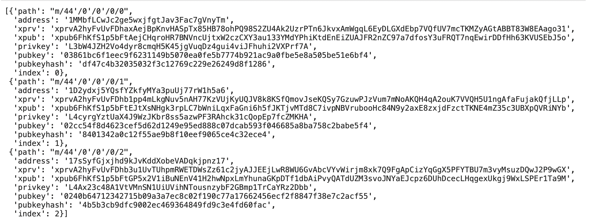

#### **Test the dictionary object coins** 
Create a dictionary object called coins that uses the derive_wallets function to derive ETH and BTCTEST wallets.

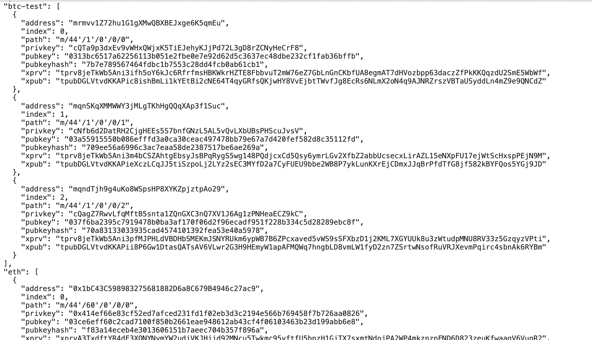

## **Linking the transaction signing libraries**

The libraries bit and web3 were used to convert the private key string to a wallet import format that is used by Bitcoin.
BTC has been funded using testnet faucets bitaps https://tbtc.bitaps.com/ into following BTCTEST address: 
'mrmvv1Z72hu1G1gXMwQBXBEJxge6K5qmEu'

## **Bitcoin Testnet transaction**

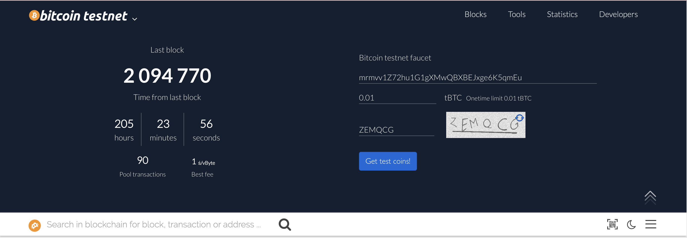

0.001 BTCTEST has been deposited to the address.

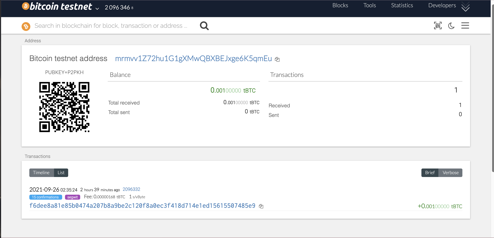

Send BTCTEST from the address to another address using below code.

``btc_key = coins[BTCTEST][0]['privkey']
btc_address = coins[BTCTEST][1]['address']
send_tx(BTCTEST, priv_key_to_account(BTCTEST, btc_key),btc_address, 0.00001)``

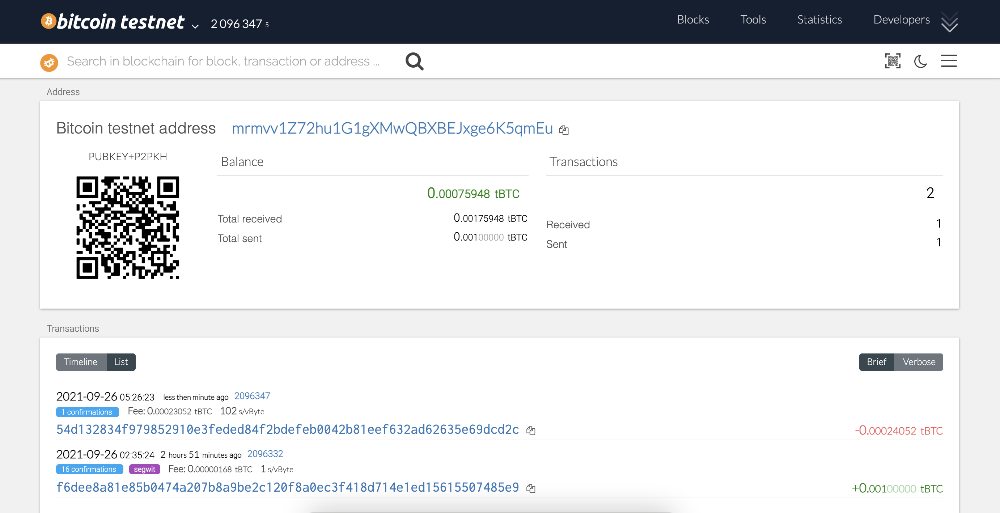

Confirmation of transaction.

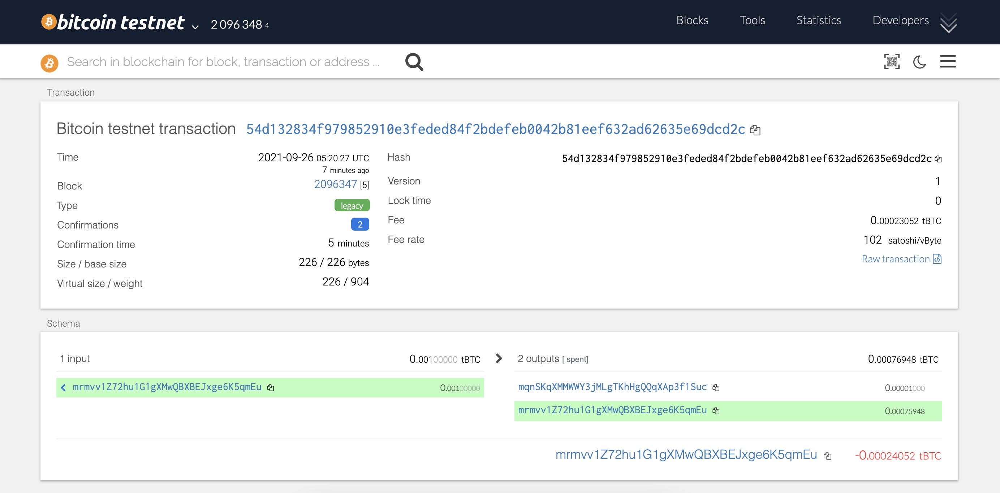

##  **Ethereum Testnet transaction**

Due to issue with local PoA, Ganache has been used to instead to pre-fund the eth test address: 1bC43C598983275681882D6a8C679B4946c27ac9

Terminal cmd1:

``./geth --datadir node1 --unlock "deE88B20e8cB4b0b16c055B411560190BC84Ebc6" --mine --rpc --allow-insecure-unlock``

``Error msg:
Fatal: Error starting protocol stack: listen tcp 127.0.0.1:8545: bind: address already in use``

Terminal cmd2:

``./geth --datadir node1 --unlock "deE88B20e8cB4b0b16c055B411560190BC84Ebc6" --mine --minerthreads 1``

Result:
Nodes are running and sync ok as below but not funded.
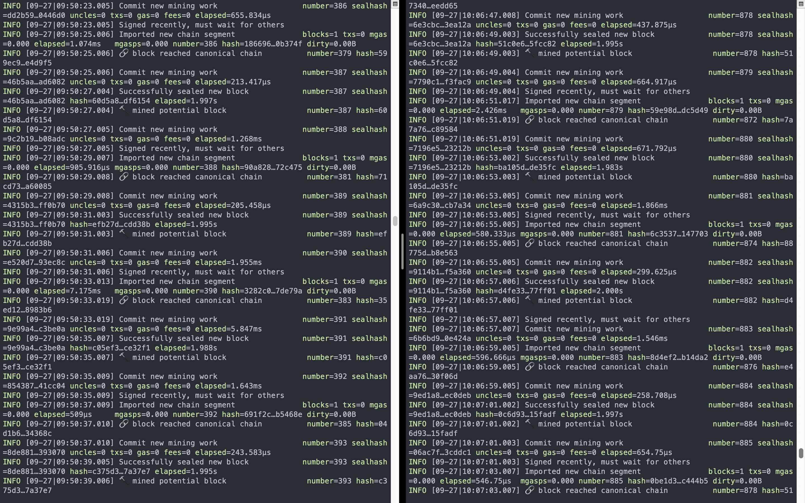

**Pre-fund ETH address using Ganache**

select new workspace ethereum from the mainmenu

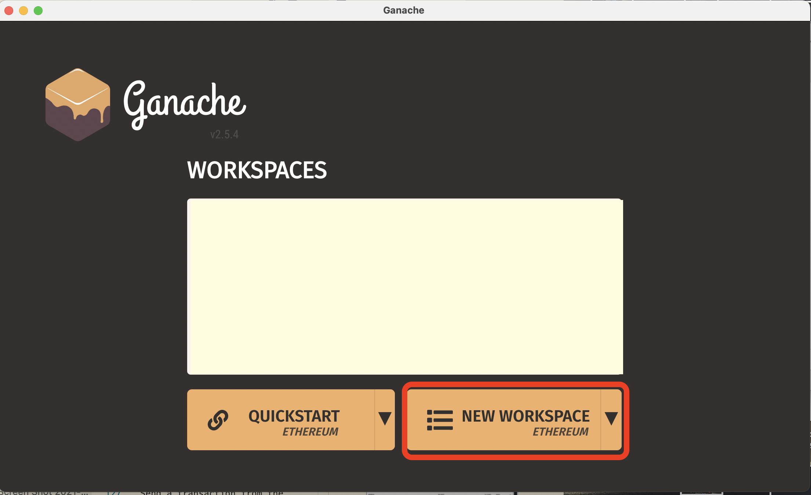

Select server tab and confirm hostname, port number and network ID are all correct. 
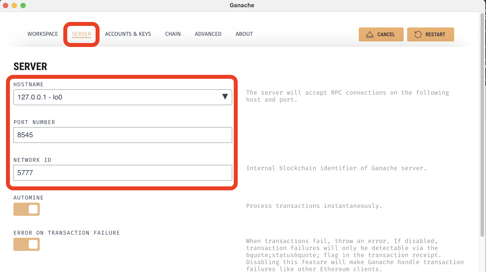

Select account & key tab and enter your mnemonic key.
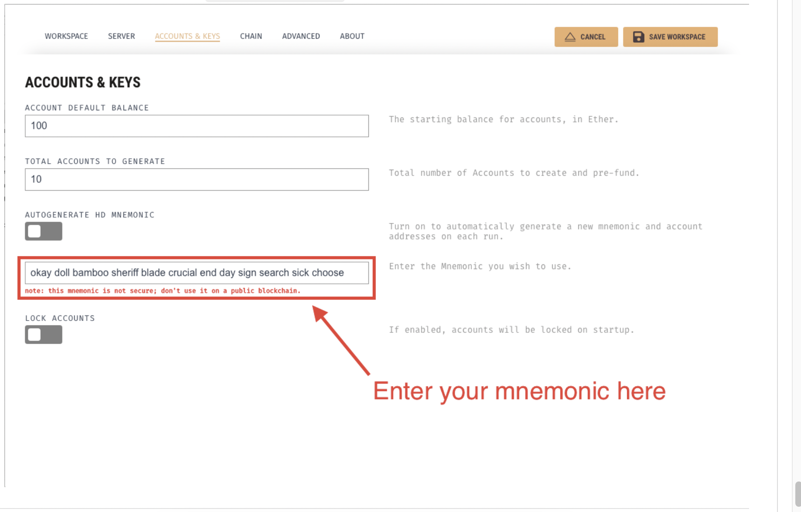

Select workspace tab, name the workspace and click save workspace button on the right.
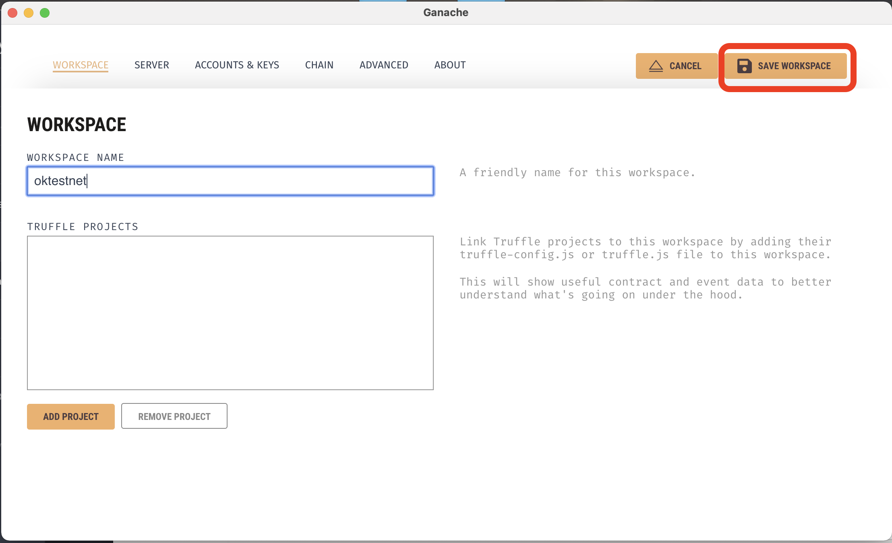

100 ETH has been deposited to the ETH test address.
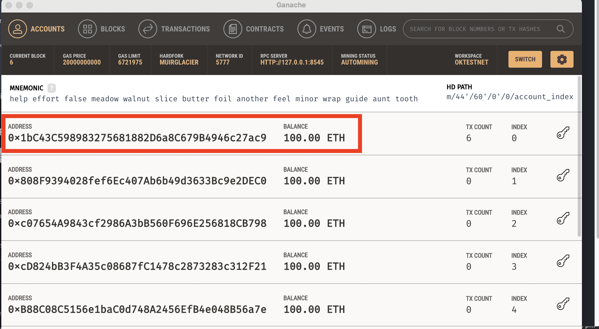

Confirm the pre-funded account & amount on MyCrypto.

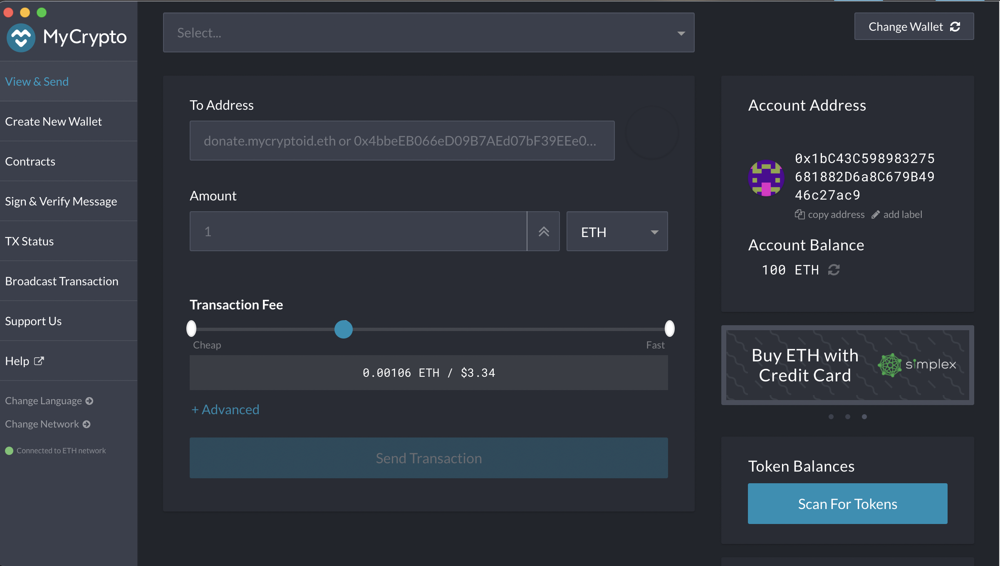

Send a transaction from the pre-funded address within the wallet to another.
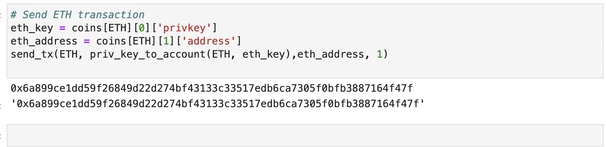

MyCrypto's TX Status, and screenshot the successful transaction.
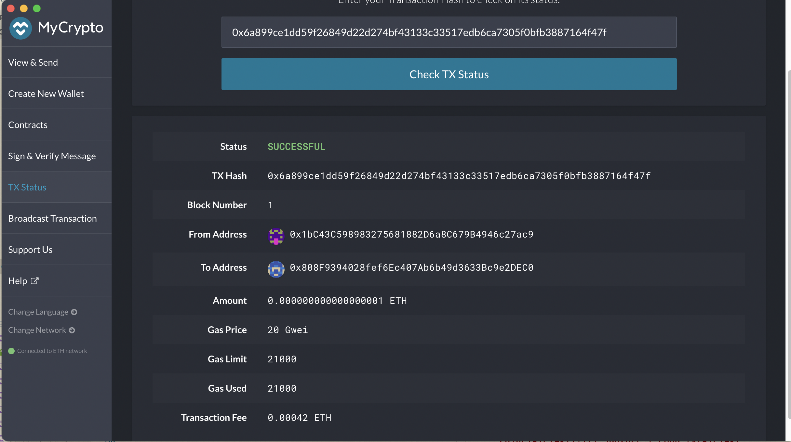

